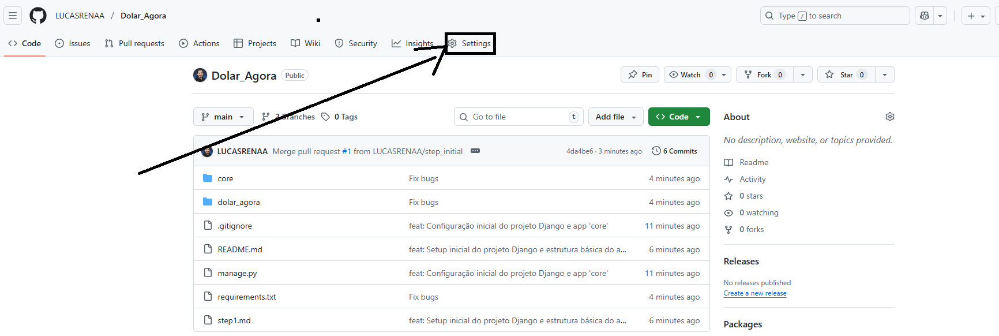
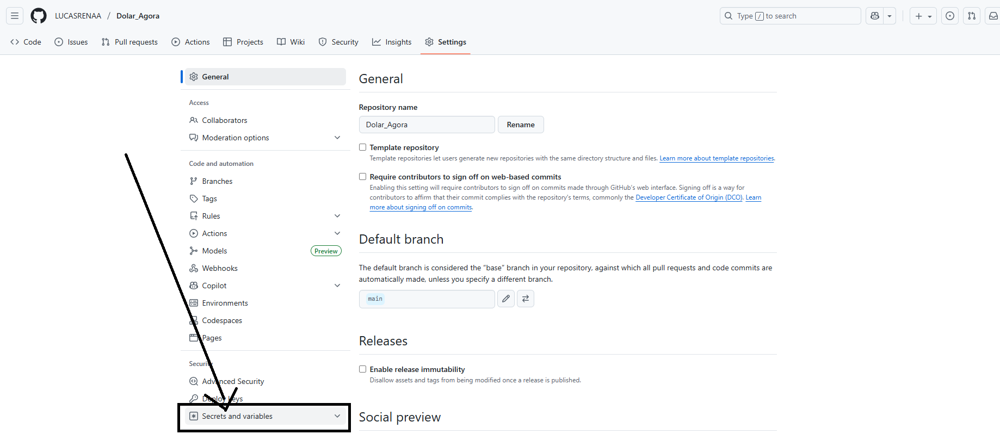
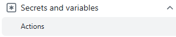
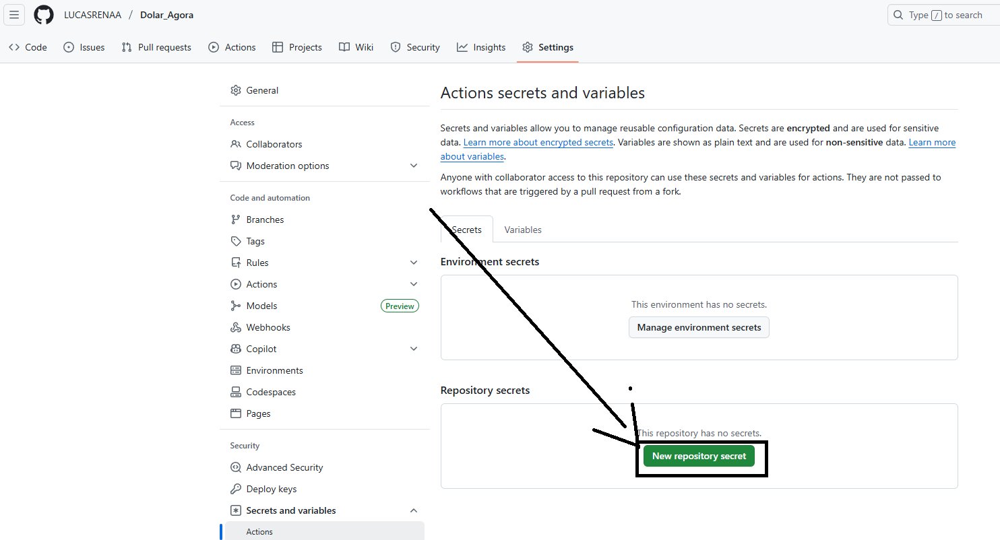
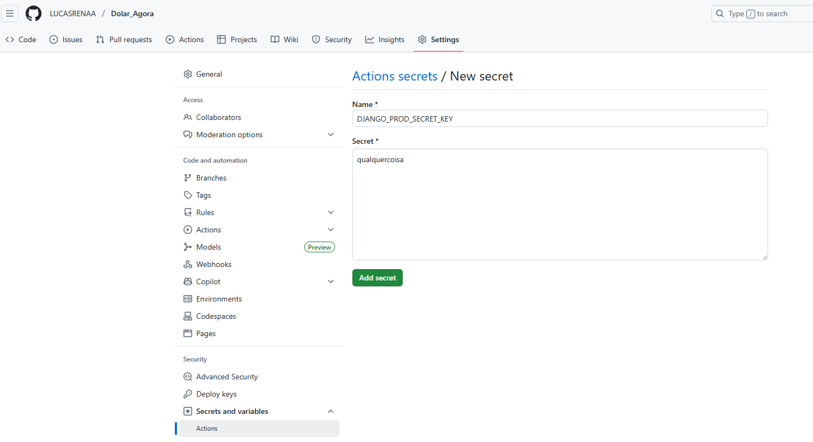
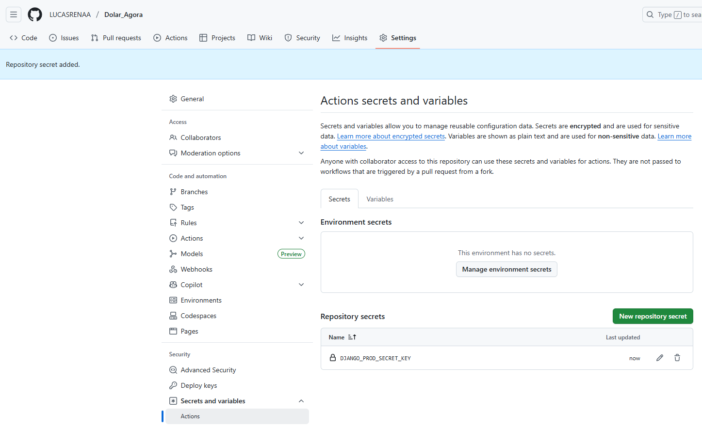

# Criando nossa pipeline de forma segura

## 💡 Inspiração e Ambiente

Bem-vindo ao Security Scan do projeto Dolar Agora. Para uma experiência completa, a recomendação sonora de hoje é:

🎧 **Música recomendada enquanto programa:** Kate Bush - Running Up That Hill

Estamos construindo segurança no código desde o início, e o coração dessa automação é o **GitHub Actions**.
   

---

## O que é GitHub Actions?

GitHub Actions é uma plataforma de Integração Contínua e Entrega Contínua (CI/CD) que permite automatizar o ciclo de vida do desenvolvimento de software.

- **Workflow:** Arquivo YAML que define a sequência de tarefas.
- **Evento (`on`):** O que aciona o workflow (ex: push, Pull Request, agendamento).
- **Jobs:** Conjuntos de passos executados em paralelo ou série.
- **Runners:** Máquinas virtuais que executam os jobs (ex: `ubuntu-latest`, `windows-latest`).
- **Steps:** Comandos individuais ou Actions reutilizáveis que realizam tarefas específicas.

---

## 🔒 Proteção de Credenciais: Criando um Secret

Para rodar o Django com segurança, é necessário uma chave secreta (`SECRET_KEY`), que **nunca deve ser armazenada no código**. Usamos um GitHub Secret para injetar essa chave de forma segura no workflow.

**Secrets** são variáveis de ambiente criptografadas, usadas para dados sensíveis (tokens, senhas).

### Passo a passo para criar o Secret `DJANGO_PROD_SECRET_KEY`:

1. No seu repositório, clique na aba **Settings**  
   
2. No menu lateral, selecione **Secrets and variables**  
   
3. Dentro, selecione a sub-aba **Actions**  
   
4. Clique no botão **New repository secret**  
   
5. Preencha o campo **Name** como `DJANGO_PROD_SECRET_KEY` e cole o valor gerado no campo **Secret**  
   
6. O GitHub confirmará a criação da sua Secret  
   

---

## 🚦 O Workflow de Segurança (Security Scan)

O workflow está em `.github/workflows/security.yml` e roda a cada push. Ele é composto pelos seguintes passos:

| Passo                        | Ação                                   | Objetivo                                                                 |
|------------------------------|----------------------------------------|--------------------------------------------------------------------------|
| Checkout repository          | `actions/checkout@v2`                  | Baixa o código no runner para análise                                    |
| Set up Python                | `actions/setup-python@v2`              | Configura o ambiente Python 3.9                                          |
| Install dependencies         | `pip install -r requirements.txt` `pip install bandit` | Instala dependências do projeto e o scanner Bandit                       |
| Run Trivy vulnerability scan | `aquasecurity/trivy-action@0.20.0`     | Verifica dependências e arquivos por vulnerabilidades e segredos          |
| Run Bandit                   | `bandit -r .`                          | Analisa o código Python em busca de falhas de segurança                  |
| Start Django server          | `python manage.py runserver &`         | Inicia o servidor Django para testes dinâmicos                           |
| OWASP ZAP Baseline Scan      | `zaproxy/action-baseline@v0.7.0`       | Teste dinâmico de segurança na aplicação web                             |
| Stop Django server           | `pkill -f "python manage.py runserver"`| Finaliza o servidor após o scan                                          |

---

Esses passos garantem que seu código seja analisado por scanners estáticos e dinâmicos, protegendo contra vulnerabilidades desde o início do desenvolvimento.

   
