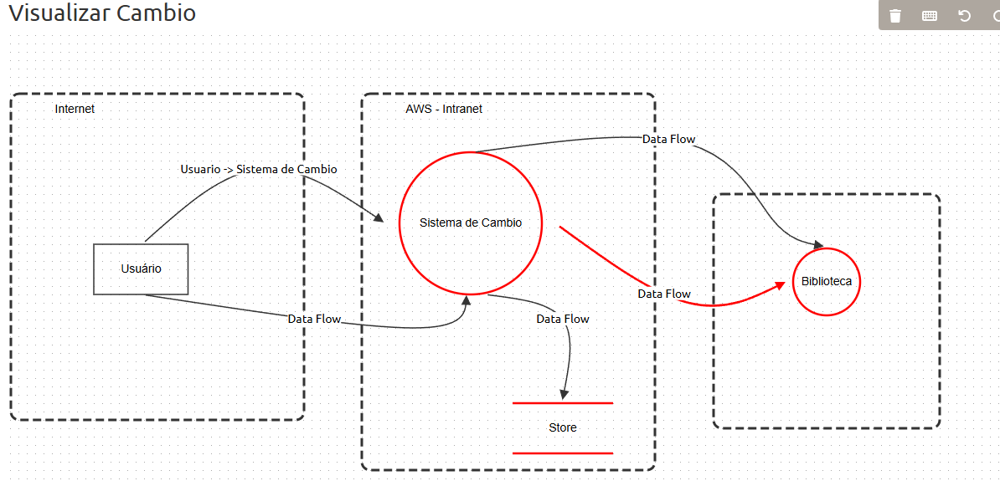

# Modelagem de Ameaças no Projeto Dolar Agora

🎧 **Música Recomendada:**  
Para se concentrar na identificação e mitigação de riscos de segurança, ouça:  
["Distant Dreamer" — Ouça no YouTube](https://www.youtube.com/watch?v=Q8FzHq2yQGg)

---

## Sobre a Modelagem de Ameaças

Este diretório reúne os artefatos da modelagem de ameaças do sistema Dolar Agora: diagrama visual, relatório em PDF e o modelo JSON exportado.

Modelagem de ameaças é o processo de identificar, entender e mitigar riscos de segurança em um sistema. Antecipar vulnerabilidades e planejar controles é essencial para garantir um desenvolvimento seguro e confiável.

No contexto do sistema de câmbio, **Disponibilidade** e **Integridade** dos dados são prioridades máximas. As ameaças críticas mapeadas concentram-se em falhas de API e manipulação de valores, pois ataques podem causar prejuízos financeiros ou indisponibilidade do serviço.

---

## Framework STRIDE

STRIDE é um modelo criado pela Microsoft para categorizar ameaças em seis tipos:

- **Spoofing:** Falsificação de identidade.
- **Tampering:** Manipulação não autorizada de dados.
- **Repudiation:** Negação de ações realizadas.
- **Information Disclosure:** Exposição de dados sensíveis.
- **Denial of Service:** Indisponibilidade do serviço.
- **Elevation of Privilege:** Elevação indevida de privilégios.

Utilizar STRIDE facilita o mapeamento e documentação das ameaças em cada componente do sistema.

---

## OWASP e Threat Dragon

A [OWASP](https://owasp.org/) é referência mundial em segurança de aplicações, oferecendo materiais e ferramentas como o OWASP Top 10.

O [OWASP Threat Dragon](https://owasp.org/www-project-threat-dragon/) é uma ferramenta gratuita para modelagem de ameaças. Permite criar diagramas, identificar riscos usando STRIDE e gerar relatórios detalhados.

---

## Arquivos neste diretório

- `image.png`: Diagrama visual da modelagem de ameaças.
- `report_pdf.pdf`: Relatório detalhado gerado pelo Threat Dragon.
- `Sistema de Cambio.json`: Modelo de ameaça exportado da ferramenta.

---

## Análise das Ameaças Identificadas

As ameaças mapeadas priorizam a disponibilidade da cotação e a integridade da informação. Veja os principais exemplos:

| Componente                | Tipo de Ameaça (STRIDE) | Risco Principal             | Severidade | Mitigação Chave                                         |
|---------------------------|-------------------------|-----------------------------|------------|---------------------------------------------------------|
| API Externa (Biblioteca)  | Spoofing                | Indisponibilidade da Cotação| Critical   | Implementar redundância (segunda API) ou cache de dados |
| API Externa (Biblioteca)  | Tampering               | Exibir cotação falsa        | Critical   | Verificar valores contra fontes secundárias/históricos  |
| Sistema de Cambio (Backend)| Repudiation            | Disputa de valor pelo usuário| High      | Gravar histórico das cotações para auditoria            |
| Store (Banco de Dados)    | Information Disclosure  | Vazamento de senhas         | Critical   | Armazenar senhas com função hash + salt                 |

---

### Imagem da arquitetura do DFD da aplicação

Utilize estes materiais para entender os riscos do sistema, planejar controles e fortalecer a segurança do projeto Dolar Agora.